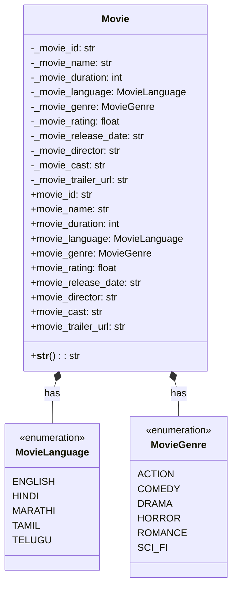

# Movie System UML Diagram

## Step 1: Movie System Classes and Enums

## Description
This diagram shows the Movie class with its properties and the associated enums for language and genre. The Movie class encapsulates all movie-related data and provides read-only access through properties. 