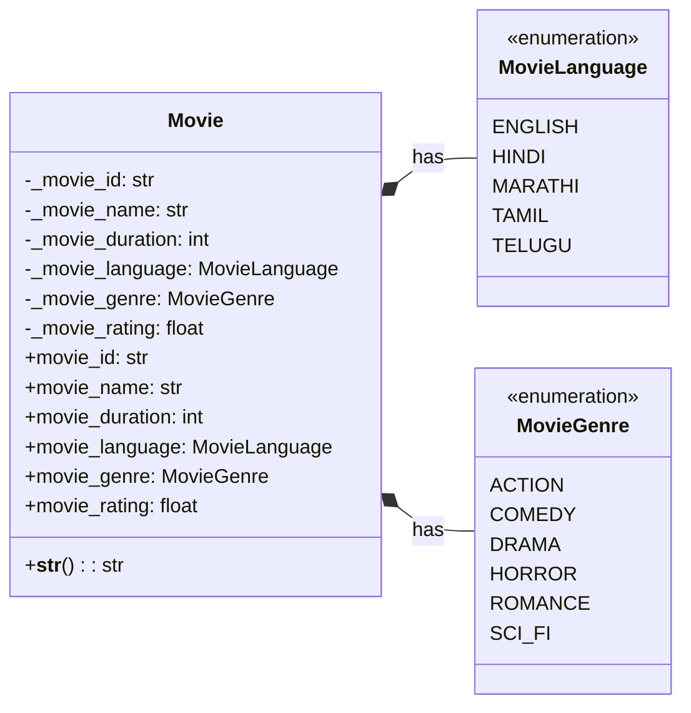

# Movie System UML Diagram

## Step 1: Movie System Classes and Enums

## Description
This diagram shows the simplified Movie class with its core properties and the associated enums for language and genre. The Movie class focuses on essential movie information needed for the booking system: ID, name, duration, language, genre, and rating. Additional details like director, cast, release date, and trailer URL have been removed to keep the diagram clean and focused. The layout is arranged horizontally for better readability. 