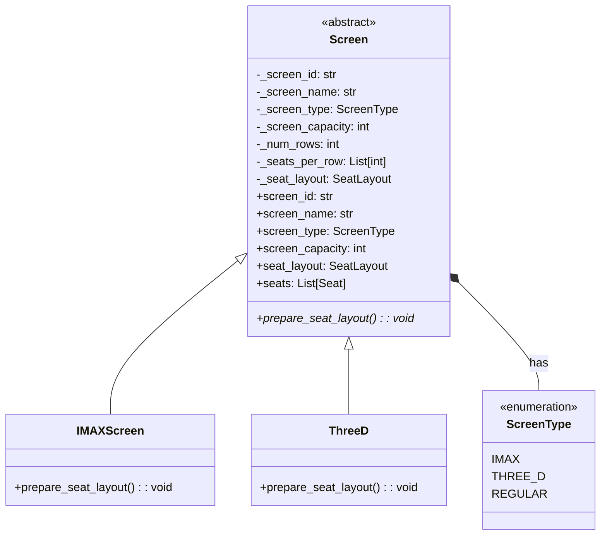

# Screen Hierarchy UML Diagram

## Step 2: Screen System with Inheritance

## Description
This diagram shows the Screen abstract class with its concrete implementations (IMAXScreen and ThreeD). The abstract class defines the interface for all screen types, and each concrete class implements its own seat layout preparation logic. The ScreenType enum defines the different types of screens available. 