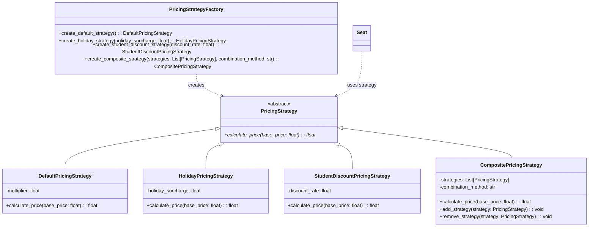

# Pricing Strategy Pattern UML Diagram

## Step 4: Pricing Strategy Pattern

## Description
This diagram shows the Strategy pattern implementation for pricing. The abstract PricingStrategy class defines the interface, and concrete strategies implement different pricing algorithms (default, holiday, student discount, composite). The PricingStrategyFactory creates different strategy instances. The Seat class uses these strategies to calculate prices. 