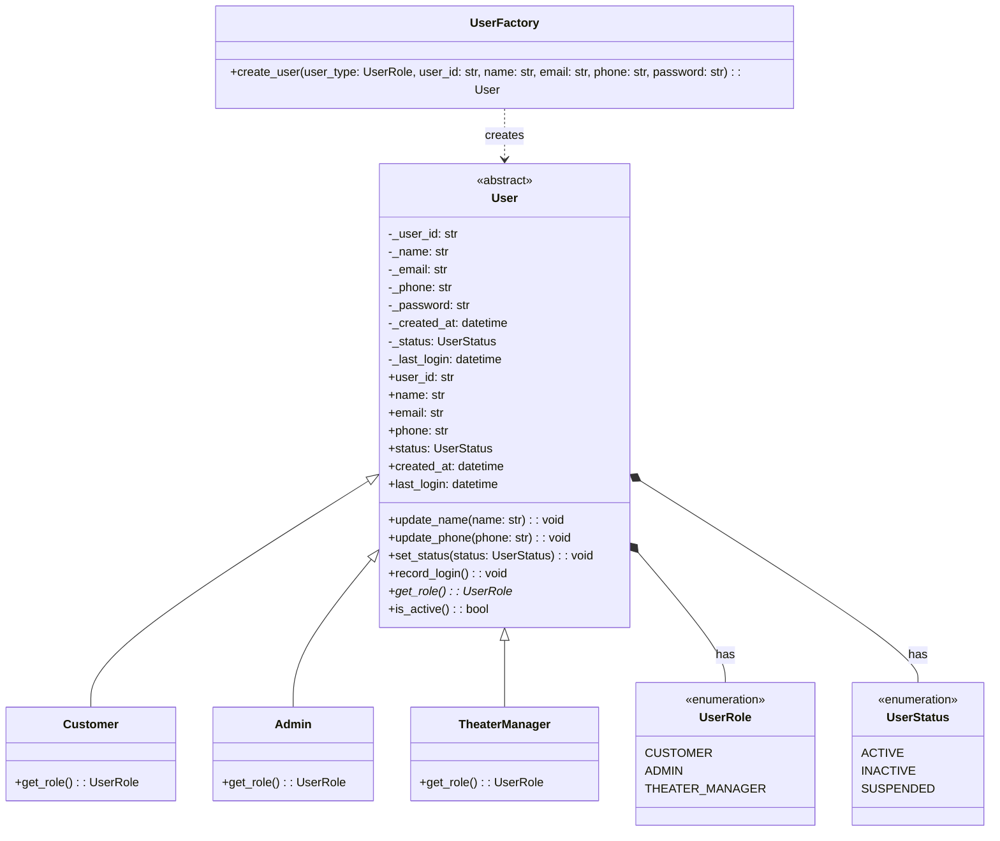

# User Hierarchy UML Diagram

## Step 5: User Management System

## Description
This diagram shows the User abstract class with its concrete implementations (Customer, Admin, TheaterManager). The UserFactory uses the Factory pattern to create different types of users. Each user has a role and status, and inherits common functionality from the abstract User class. 