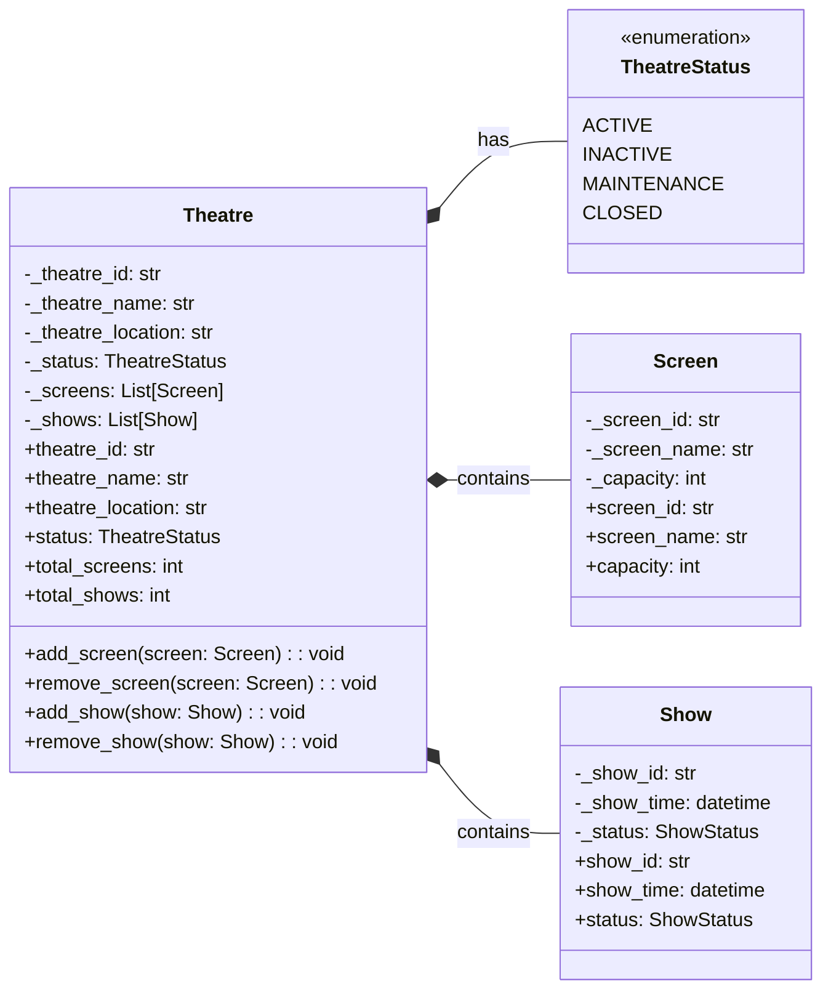

# Theatre Level UML Diagram

## Theatre Management

## Description
This diagram shows the Theatre-level view focusing on theatre management. The Theatre contains multiple Screens and Shows, with a status indicating its operational state. Simplified to show only essential theatre-level operations and relationships. 