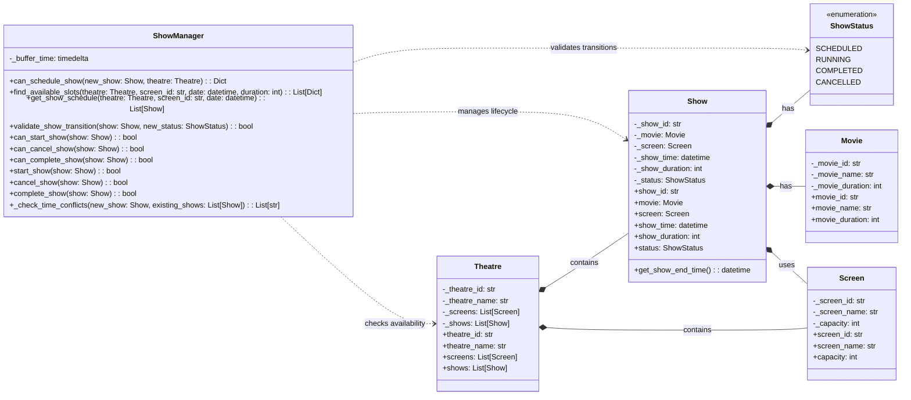

# Show Manager UML Diagram

## Show Scheduling & Lifecycle Management

## Description
This diagram shows the ShowManager's responsibilities for show scheduling, validation, and lifecycle management. It handles time conflict checking, show status transitions, and scheduling operations. The ShowManager ensures proper show scheduling and manages the complete lifecycle of shows from scheduling to completion. 