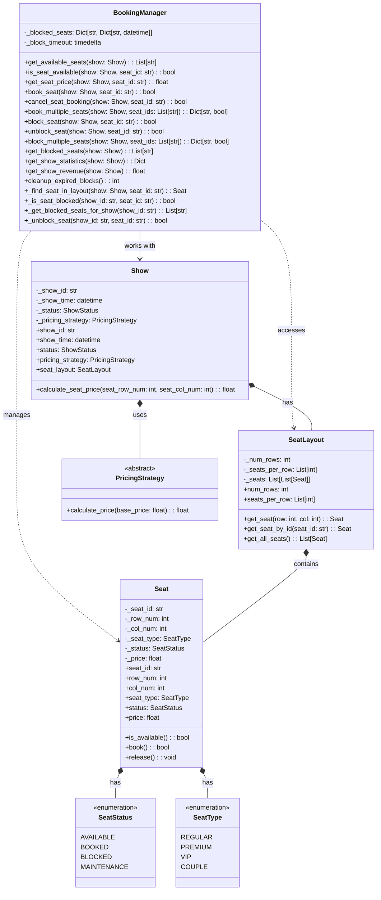

# Booking Manager UML Diagram

## Seat Booking & Management

## Description
This diagram shows the BookingManager's responsibilities for seat booking, availability management, and financial operations. It handles seat blocking, booking, pricing, and provides statistics and revenue calculations. The BookingManager manages the complete seat lifecycle from availability checking to booking and revenue tracking. The layout is balanced with both vertical and horizontal elements for better visual distribution. 