# Complete System UML Diagram

## Step 8: Complete System Integration

```mermaid
classDiagram
    %% Enums
    class MovieLanguage {
        <<enumeration>>
        ENGLISH
        HINDI
        MARATHI
        TAMIL
        TELUGU
    }
    
    class MovieGenre {
        <<enumeration>>
        ACTION
        COMEDY
        DRAMA
        HORROR
        ROMANCE
        SCI_FI
    }
    
    class ScreenType {
        <<enumeration>>
        IMAX
        THREE_D
        REGULAR
    }
    
    class SeatStatus {
        <<enumeration>>
        AVAILABLE
        BOOKED
        BLOCKED
    }
    
    class SeatType {
        <<enumeration>>
        REGULAR
        PREMIUM
        RECLINER
    }
    
    class UserRole {
        <<enumeration>>
        CUSTOMER
        ADMIN
        THEATER_MANAGER
    }
    
    class UserStatus {
        <<enumeration>>
        ACTIVE
        INACTIVE
        SUSPENDED
    }
    
    class TheatreStatus {
        <<enumeration>>
        ACTIVE
        INACTIVE
        MAINTENANCE
        CLOSED
    }
    
    class ShowStatus {
        <<enumeration>>
        SCHEDULED
        RUNNING
        COMPLETED
        CANCELLED
    }
    
    %% Core Classes
    class Movie {
        -_movie_id: str
        -_movie_name: str
        -_movie_duration: int
        -_movie_language: MovieLanguage
        -_movie_genre: MovieGenre
        -_movie_rating: float
        -_movie_release_date: str
        -_movie_director: str
        -_movie_cast: str
        -_movie_trailer_url: str
        +movie_id: str
        +movie_name: str
        +movie_duration: int
        +movie_language: MovieLanguage
        +movie_genre: MovieGenre
        +movie_rating: float
        +movie_release_date: str
        +movie_director: str
        +movie_cast: str
        +movie_trailer_url: str
        +__str__(): str
    }
    
    %% Screen Hierarchy
    class Screen {
        <<abstract>>
        -_screen_id: str
        -_screen_name: str
        -_screen_type: ScreenType
        -_screen_capacity: int
        -_num_rows: int
        -_seats_per_row: List[int]
        -_seat_layout: SeatLayout
        +screen_id: str
        +screen_name: str
        +screen_type: ScreenType
        +screen_capacity: int
        +seat_layout: SeatLayout
        +seats: List[Seat]
        +prepare_seat_layout()*: void
    }
    
    class IMAXScreen {
        +prepare_seat_layout(): void
    }
    
    class ThreeD {
        +prepare_seat_layout(): void
    }
    
    %% Seat Hierarchy
    class Seat {
        <<abstract>>
        -_seat_id: str
        -_seat_number: str
        -_base_price: float
        -_status: SeatStatus
        -_created_at: datetime
        -_updated_at: datetime
        +seat_id: str
        +seat_number: str
        +base_price: float
        +status: SeatStatus
        +is_available(): bool
        +is_booked(): bool
        +is_blocked(): bool
        +book_seat(): void
        +release_seat(): void
        +get_seat_type()*: SeatType
        +calculate_price(pricing_strategy: PricingStrategy): float
    }
    
    class RegularSeat {
        +get_seat_type(): SeatType
    }
    
    class PremiumSeat {
        +get_seat_type(): SeatType
    }
    
    class ReclinerSeat {
        +get_seat_type(): SeatType
    }
    
    class SeatFactory {
        +create_seat(seat_type: SeatType, seat_id: str, seat_number: str, base_price: float): Seat
        +create_seat_row(seat_type: SeatType, row_number: int, seats_count: int, base_price: float): List[Seat]
    }
    
    %% Pricing Strategy
    class PricingStrategy {
        <<abstract>>
        +calculate_price(base_price: float)*: float
    }
    
    class DefaultPricingStrategy {
        -multiplier: float
        +calculate_price(base_price: float): float
    }
    
    class HolidayPricingStrategy {
        -holiday_surcharge: float
        +calculate_price(base_price: float): float
    }
    
    class StudentDiscountPricingStrategy {
        -discount_rate: float
        +calculate_price(base_price: float): float
    }
    
    class CompositePricingStrategy {
        -strategies: List[PricingStrategy]
        -combination_method: str
        +calculate_price(base_price: float): float
        +add_strategy(strategy: PricingStrategy): void
        +remove_strategy(strategy: PricingStrategy): void
    }
    
    class PricingStrategyFactory {
        +create_default_strategy(): DefaultPricingStrategy
        +create_holiday_strategy(holiday_surcharge: float): HolidayPricingStrategy
        +create_student_discount_strategy(discount_rate: float): StudentDiscountPricingStrategy
        +create_composite_strategy(strategies: List[PricingStrategy], combination_method: str): CompositePricingStrategy
    }
    
    %% User Hierarchy
    class User {
        <<abstract>>
        -_user_id: str
        -_name: str
        -_email: str
        -_phone: str
        -_password: str
        -_created_at: datetime
        -_status: UserStatus
        -_last_login: datetime
        +user_id: str
        +name: str
        +email: str
        +phone: str
        +status: UserStatus
        +created_at: datetime
        +last_login: datetime
        +update_name(name: str): void
        +update_phone(phone: str): void
        +set_status(status: UserStatus): void
        +record_login(): void
        +get_role()*: UserRole
        +is_active(): bool
    }
    
    class Customer {
        +get_role(): UserRole
    }
    
    class Admin {
        +get_role(): UserRole
    }
    
    class TheaterManager {
        +get_role(): UserRole
    }
    
    class UserFactory {
        +create_user(user_type: UserRole, user_id: str, name: str, email: str, phone: str, password: str): User
    }
    
    %% Core Business Classes
    class Theatre {
        -_theatre_id: str
        -_theatre_name: str
        -_theatre_location: str
        -_theatre_address: str
        -_theatre_contact: str
        -_theatre_email: str
        -_status: TheatreStatus
        -_screens: List[Screen]
        -_shows: List[Show]
        +theatre_id: str
        +theatre_name: str
        +theatre_location: str
        +theatre_address: str
        +theatre_contact: str
        +theatre_email: str
        +status: TheatreStatus
        +screens: List[Screen]
        +shows: List[Show]
        +total_screens: int
        +total_shows: int
        +set_status(status: TheatreStatus): void
        +add_screen(screen: Screen): void
        +remove_screen(screen: Screen): void
        +get_screen_by_id(screen_id: str): Screen
        +get_show_by_id(show_id: str): Show
        +get_shows_by_screen_id(screen_id: str): List[Show]
        +add_show(show: Show): void
        +remove_show(show: Show): void
    }
    
    class Show {
        -_show_id: str
        -_movie: Movie
        -_screen: Screen
        -_show_time: datetime
        -_show_duration: int
        -_pricing_strategy: PricingStrategy
        -_status: ShowStatus
        +show_id: str
        +movie: Movie
        +screen: Screen
        +show_time: datetime
        +show_duration: int
        +pricing_strategy: PricingStrategy
        +status: ShowStatus
        +seat_layout: SeatLayout
        +get_show_end_time(): datetime
        +calculate_seat_price(seat_row_num: int, seat_col_num: int): float
        +_find_seat_by_row_col(seat_row_num: int, seat_col_num: int): Seat
    }
    
    class SeatLayout {
        -_num_rows: int
        -_seats_per_row: List[int]
        -_seats: List[List[Seat]]
        +num_rows: int
        +seats_per_row: List[int]
        +get_seat(row: int, col: int): Seat
        +get_seat_by_id(seat_id: str): Seat
        +get_all_seats(): List[Seat]
    }
    
    %% Manager Classes
    class TheatreManager {
        -_theatres: Dict[str, Theatre]
        -_show_manager: ShowManager
        +add_theatre(theatre: Theatre): bool
        +get_theatre(theatre_id: str): Theatre
        +get_all_theatres(): List[Theatre]
        +get_theatres_by_location(location: str): List[Theatre]
        +get_active_theatres(): List[Theatre]
        +set_theatre_status(theatre_id: str, status: TheatreStatus): bool
        +add_screen(theatre_id: str, screen: Screen): bool
        +get_screen(theatre_id: str, screen_id: str): Screen
        +remove_screen(theatre_id: str, screen_id: str): bool
        +add_show(theatre_id: str, show: Show): bool
        +get_show(theatre_id: str, show_id: str): Show
        +get_shows_by_theatre(theatre_id: str): List[Show]
        +get_available_shows(theatre_id: str): List[Show]
        +start_show(theatre_id: str, show_id: str): bool
        +cancel_show(theatre_id: str, show_id: str): bool
        +complete_show(theatre_id: str, show_id: str): bool
        +remove_show(theatre_id: str, show_id: str): bool
        +cancel_and_remove_show(theatre_id: str, show_id: str): bool
        +find_available_slots(theatre_id: str, screen_id: str, date: datetime, duration: int): List[Dict]
        +get_show_schedule(theatre_id: str, screen_id: str, date: datetime): List[Show]
        +validate_screen_show_relationships(theatre_id: str): Dict
        +cleanup_orphaned_shows(theatre_id: str): int
    }
    
    class ShowManager {
        -_buffer_time: timedelta
        +can_schedule_show(new_show: Show, theatre: Theatre): Dict
        +find_available_slots(theatre: Theatre, screen_id: str, date: datetime, duration: int): List[Dict]
        +get_show_schedule(theatre: Theatre, screen_id: str, date: datetime): List[Show]
        +validate_show_transition(show: Show, new_status: ShowStatus): bool
        +can_start_show(show: Show): bool
        +can_cancel_show(show: Show): bool
        +can_complete_show(show: Show): bool
        +start_show(show: Show): bool
        +cancel_show(show: Show): bool
        +complete_show(show: Show): bool
        +_check_time_conflicts(new_show: Show, existing_shows: List[Show]): List[str]
    }
    
    class BookingManager {
        -_blocked_seats: Dict[str, Dict[str, datetime]]
        -_block_timeout: timedelta
        +get_available_seats(show: Show): List[str]
        +is_seat_available(show: Show, seat_id: str): bool
        +get_seat_price(show: Show, seat_id: str): float
        +book_seat(show: Show, seat_id: str): bool
        +cancel_seat_booking(show: Show, seat_id: str): bool
        +book_multiple_seats(show: Show, seat_ids: List[str]): Dict[str, bool]
        +block_seat(show: Show, seat_id: str): bool
        +unblock_seat(show: Show, seat_id: str): bool
        +block_multiple_seats(show: Show, seat_ids: List[str]): Dict[str, bool]
        +get_blocked_seats(show: Show): List[str]
        +get_show_statistics(show: Show): Dict
        +get_show_revenue(show: Show): float
        +cleanup_expired_blocks(): int
        +_find_seat_in_layout(show: Show, seat_id: str): Seat
        +_is_seat_blocked(show_id: str, seat_id: str): bool
        +_get_blocked_seats_for_show(show_id: str): List[str]
        +_unblock_seat(show_id: str, seat_id: str): bool
    }
    
    %% Relationships
    %% Inheritance
    Screen <|-- IMAXScreen
    Screen <|-- ThreeD
    Seat <|-- RegularSeat
    Seat <|-- PremiumSeat
    Seat <|-- ReclinerSeat
    User <|-- Customer
    User <|-- Admin
    User <|-- TheaterManager
    PricingStrategy <|-- DefaultPricingStrategy
    PricingStrategy <|-- HolidayPricingStrategy
    PricingStrategy <|-- StudentDiscountPricingStrategy
    PricingStrategy <|-- CompositePricingStrategy
    
    %% Composition/Aggregation
    Theatre *-- Screen : contains
    Theatre *-- Show : contains
    Show *-- Movie : has
    Show *-- Screen : uses
    Show *-- PricingStrategy : uses
    Screen *-- SeatLayout : has
    SeatLayout *-- Seat : contains
    TheatreManager *-- ShowManager : uses
    TheatreManager *-- Theatre : manages
    BookingManager ..> Show : works with
    BookingManager ..> Seat : manages
    
    %% Factory Pattern
    SeatFactory ..> Seat : creates
    UserFactory ..> User : creates
    PricingStrategyFactory ..> PricingStrategy : creates
    
    %% Strategy Pattern
    Seat ..> PricingStrategy : uses strategy
    
    %% Enums
    Movie *-- MovieLanguage : has
    Movie *-- MovieGenre : has
    Screen *-- ScreenType : has
    Seat *-- SeatStatus : has
    Seat *-- SeatType : has
    User *-- UserRole : has
    User *-- UserStatus : has
    Theatre *-- TheatreStatus : has
    Show *-- ShowStatus : has
```

## Description
This is the complete UML class diagram showing all classes, their relationships, and design patterns used in the movie ticket booking system. It demonstrates:

1. **Inheritance hierarchies** for Screen, Seat, User, and PricingStrategy
2. **Composition relationships** showing ownership
3. **Association relationships** showing usage
4. **Factory patterns** for creating objects
5. **Strategy pattern** for pricing
6. **All enums** and their relationships
7. **Manager classes** and their responsibilities

The diagram captures the complete architecture with proper separation of concerns and design patterns. 